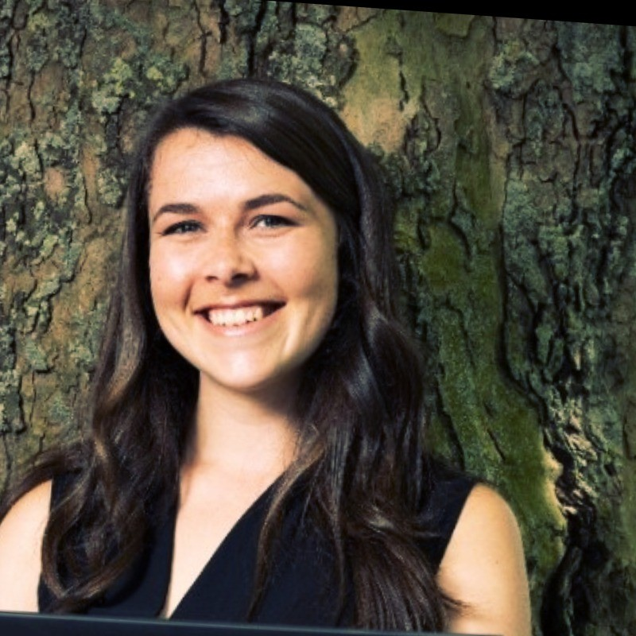
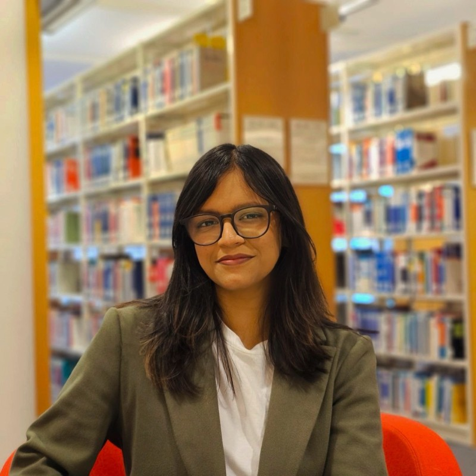
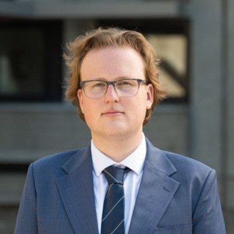
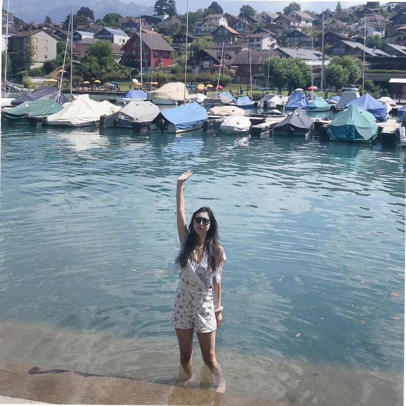
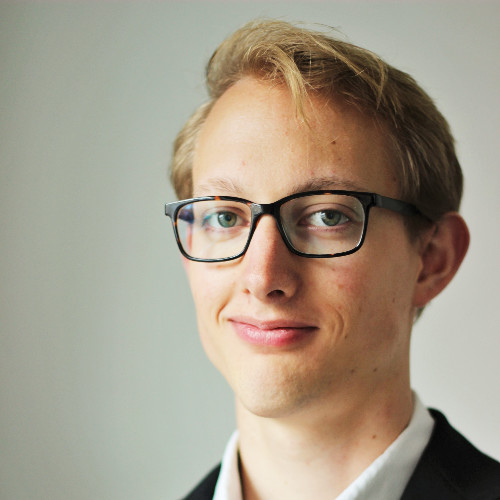

# Team

Our lab consists of **2 PhD candidates** and **3 Engineering Doctorate (EngD) students**, all supervised jointly by researchers from Kadaster and the University of Twente.

## Researchers

#### Alexandra (Lexi) Rowland [✉](mailto:a.c.s.j.rowland@utwente.nl) 

**PhD Candidate** · University of Twente

Security and privacy-aware virtual knowledge graphs — ontology-based policy enforcement and LLM integration.

[Project: Security & Privacy-Aware VKGs](research.llms.md#security-privacy-vkg)

#### Anagha Phaniraj [✉](mailto:anagha.phaniraj@utwente.nl) 

**PhD Candidate** · University of Twente

Improving LLM pre-training and interpretability using knowledge graphs for land administration domain reasoning.

[Project: LLM Enhancement via Knowledge Graphs](research.llms.md#llm-knowledge-graphs)

#### Sven Mol [✉](mailto:s.mol@utwente.nl) 

**Engineering Doctorate** · University of Twente

VKG infrastructure design, federated querying, and performance evaluation for legacy systems at Kadaster.

[Project: VKGs for Legacy Systems](research.llms.md#vkg-legacy-systems)

#### Lei (Charlotte) Wang [✉](mailto:lei.wang@utwente.nl) 

**Engineering Doctorate** · University of Twente

KG-enhanced LLM chatbot for natural language access to land administration information.

[Project: LLM & KG Chatbot](research.llms.md#llm-kg-chatbot)

#### Stefan Bussemaker [✉](mailto:s.bussemaker@utwente.nl) 

**Engineering Doctorate** · University of Twente

Transparent AI system design for automated information extraction from notarial deeds.

[Project: AI Extraction from Notarial Deeds](research.llms.md#ai-notarial-deeds)

------------------------------------------------------------------------

## Supervisors

**Kadaster**

#### Erwin Folmer [✉](mailto:Erwin.Folmer@han.nl)

Lector Applied Data Science & AI · HAN

**University of Twente — Geo-Information Processing (GIP)**

#### Mahdi Farnaghi [✉](mailto:m.farnaghi@utwente.nl)

Assistant Professor

#### Frank Ostermann [✉](mailto:f.o.ostermann@utwente.nl)

Associate Professor

#### Raul Zurita Milla [✉](mailto:r.zurita-milla@utwente.nl)

Full Professor

#### Rob Lemmens [✉](mailto:r.l.g.lemmens@utwente.nl)

Assistant Professor

**University of Twente — Semantics, Cybersecurity & Services (SCS)**

#### Tiago Prince Sales [✉](mailto:t.princesales@utwente.nl)

Assistant Professor

#### Giancarlo Guizzardi [✉](mailto:g.guizzardi@utwente.nl)

Full Professor

#### Luiz Bonino da Silva Santos [✉](mailto:l.o.boninodasilvasantos@utwente.nl)

Associate Professor

#### Thijs van Ede [✉](mailto:t.s.vanede@utwente.nl)

Assistant Professor
